# 谜题

<!-- > 注：实际的历史环境中会出现拉丁文等语种。出于方便玩家的目的，我们规定，本次解谜的所有题目都限定中文和英文，不会在拉丁文等方面难为玩家；至于其它语言，均会翻译成中/英文。 -->

## 第1关 [https://www.cpphusky.xyz/goal](https://www.cpphusky.xyz/goal)

界面上显示一段看似乱序和随机旋转的英文字母表。

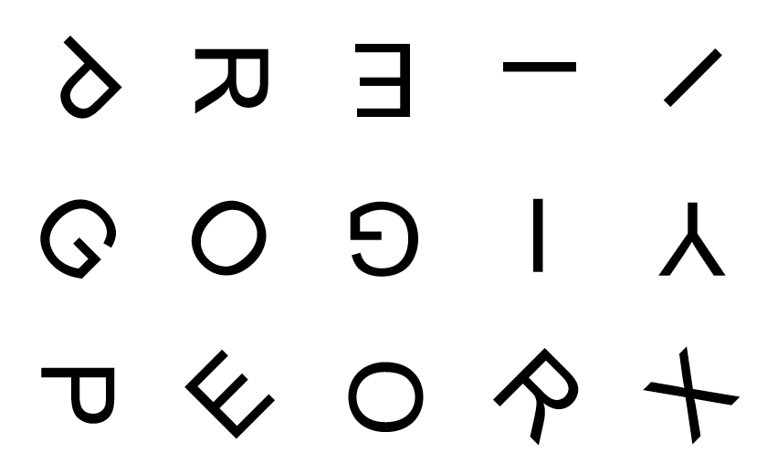

实际上，玩家需要根据毎个字母的方向来确定它的下一个字母是谁，进而把整个字符串序列理出来。

有些字母的方向有多重可能性，所以需要玩家都试试。

答案：`/^\s*pope\s*gregory\s*xiii\s*$/i`

## 第1关提示 [https://www.cpphusky.xyz/systematic](https://www.cpphusky.xyz/systematic)

界面上显示一段文字 `But - Out - The - Use`

答案：`^\s*-1148\s*$`

解开本关后将得到第1关提示：`首尾相连，串成一句`

## 第2关 [https://www.cpphusky.xyz/maze](https://www.cpphusky.xyz/maze)

这是一个三维表面图迷宫，见 [Attachment/Cube_maze.nb](Attachment/Cube_maze.nb) 。

其表面展开图参见 [Attachment/Map.xlsx](Attachment/Map.xlsx) 。

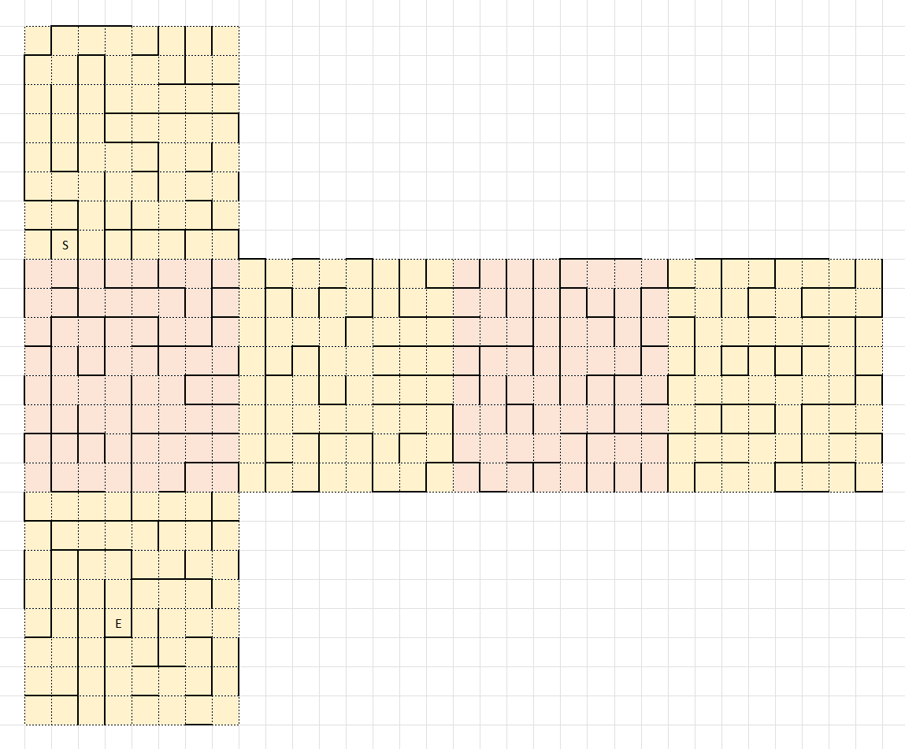

玩家无法直接得知这个迷宫是三维的，他们只能看到自己所在的那个面。如果玩家在不同的面中切换，那么显示的面会“保持视角方向”地切换。

### 解释：第2关的视角问题

> 想像一下，我们把一个棱长为$2$的正方体置于坐标轴上，正方体中心在原点，所有棱和面都与坐标轴平行/垂直。我们沿着$x$轴向$(-1,0,0)$方向看过去，能看到的面是由$(1,y,z)$构成的。
>
> 在迷宫中向左走出界，就会来到左边的面。为了不改变视角的方向，我们选择让这个正方体绕$z$轴旋转$\frac\pi2$（所有旋转均遵循右手定则）；接下来我们向上走出界，为了不改变视角的方向，我们让这个正方体绕$y$轴旋转$\frac\pi2$；再向右走出界，我们让这个正方体绕$z$轴旋转$-\frac\pi2$。
>
> 根据四元数的相关理论，绕$z$轴旋转得到$q_1=\frac{1+\mathrm k}{\sqrt2}$, $q_2=\frac{1+\mathrm j}{\sqrt2}$, $q_3=\frac{1-\mathrm k}{\sqrt2}$，所以对于点$(1,0,0)$来说，我们有
>
> $$q_3q_2q_1(\mathrm i)q_1^*q_2^*q_3^*=\mathrm i$$
>
> 说人话就是，这个正方体在经历了向左、向上、向右的转动（绕$z$轴$\frac\pi2$，绕$y$轴$\frac\pi2$，再绕$z$轴$-\frac\pi2$）之后，又会回到原来的位置。
>
> 虽然这个面回到了原来的位置，然而，我们看到的东西会发生变化。对于原来面上的任意一个点$(-1,y_0,z_0)$来说，我们有
>
> $$q_3q_2q_1(\mathrm i+y_0\mathrm j+z_0\mathrm k)q_1^*q_2^*q_3^*=\mathrm i-z_0\mathrm j+y_0\mathrm k$$
>
> 说人话就是，坐标$(1,y_0,z_0)$处的点变到了$(1,-z_0,y_0)$处。这个正方体在经历了如上过程之后，我们看到的虽然还是原来那个面，但看到的内容是它逆时针转了$\frac\pi2$的结果。
>
> 我的设计思路很直白，就是把6个面的4个方向都画一遍，一共画出24个面，然后把每面四周连接到哪4个面都人为规定出来。总共写96组关系就可以了。
>
> 当然，这样也就意味着会有4个终点（其实这4个终点是同一个）。
>
> 在Mathematica中，我们可以拖动出这样的效果。

## 第2关提示 [https://www.cpphusky.xyz/morse](https://www.cpphusky.xyz/morse)

提供一段音频 [Attachment/Morse.wav](Attachment/Morse.wav) 。

答案：`/^\s*surface\s*of\s*the\s*$/i`

解开本关后将得到第1关提示：`cube`

## 第3关

## 第4关 [https://www.cpphusky.xyz/leonardo](https://www.cpphusky.xyz/leonardo)

界面上显示十二个方块，左六右六，中间略微留空。

除一个为空白方块之外，其它方块分别贴上 [Attachment/Apostles](Attachment/Apostles) 中的十一个肖像。这十二个方块之间的顺序是随机的。

玩家需要把十二个方块的顺序调整为：

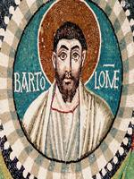 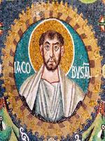 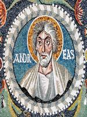  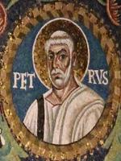 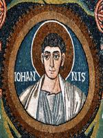 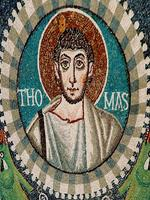 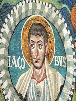 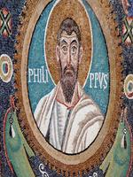 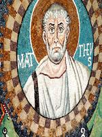 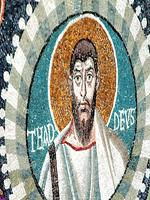 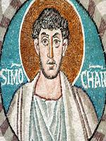

## 第4关提示 [https://www.cpphusky.xyz/chronology](https://www.cpphusky.xyz/chronology)

界面上显示十二个方块，左六中三右三，间隔处略微留空。

每个方块分别有文字 `Ꞓ` `O` `S` `D` `C` `P` `T` `J` `K` `Pg` `N` `Q`，这十二个方块之间的顺序是随机的。

玩家需要把十二个方块的顺序调整为上述顺序或其逆序。

解开本关后将得到第4关提示：`Latina`
