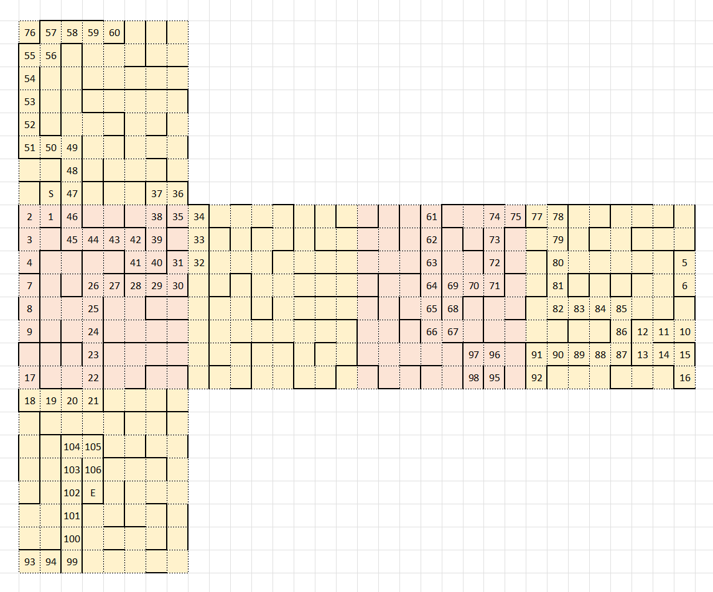

# 谜题解答

## 第1关

其实只要把每个字母的“下一个”找出来，然后连成一张有向图。注意，如果你仔细看的话，会发现字母 O 是有方向的，它不是正圆形。

这关的目标就很明确了：在这个图中找一个[哈密顿路径](https://baike.baidu.com/item/%E5%93%88%E5%AF%86%E9%A1%BF%E5%9B%9E%E8%B7%AF/5575399)（红色）。咱一眼就能看出来P是首字母，然后一点一点顺着走也能得出答案了。

## 第1关提示

这关是2023解谜第3题的故技重施。背后的知识是化学元素系统命名法。

根据系统命名法，`But` 对应 213 号元素，`Out` 对应 813 号元素，`The` 对应 369 号元素，`Use` 对应 179 号元素，所以本关的答案就是

$$213-813-369-179=-1148$$

## 第2关

这关是个迷宫，看上去好像很简单，所以我给它增加了步数限制，倘若你不画地图莽着走，应该就很难走出去了。

但是假如你认认真真画了地图的话，很快就会发现端倪——若是按照平面地图的画法来作图，我们画出来的地图将会是自相予盾的。

这就意味着两种可能：要么，相邻子地图之间的关联不对应任何物理实体；要么，相邻子地图之间的关联对应一种物殊的物理实体，只不过我们还没想到它是什么。

如果做了提示关卡，你就会知道这个迷宫其实布局在一个正方体的表面。即便没做提示关卡，只要你够敏锐的话，也能发现自己弯弯绕绕最后其实回到了原点，唯一的特殊之处在于自己所处的子地图是转了一个方向的——这肯定暗示了什么对吧。

只要发现了这个要素，那么整个问题其实也就不难了，自己把整个地图的平面展开图画出来，差不多也就知道该怎么走了。

## 第2关提示

这是一段摩斯电码，听译或者把它扔给在线的解码工具，如 [morsecode.world-decoder](https://morsecode.world/international/decoder/audio-decoder-adaptive.html) 。很快就可以得到明文 `surface of the` 。

这段明文看上去欲言又止，可能缺少什么信息，所以先把它填进去试试，然后就会发现可以通关，并得到提示信息 `cube` 。

所以这关的完整提示应该是 `surface of the cube` ！

## 第3关

## 第4关

图中有十一个人和一个空位。要联想的话应该不难想到十二使徒（Apostles）。其中的犹大（Judas Iscariot）是叛徒被留白也很合理，那么剩下的应当是另外十一个使徒了。

用百度识图可以直接或间接查到一些信息，比如“圣维塔尔教堂”；而Google识图给出的结果更明确，能索引到Wikipedia中的引用文件。总之，我们可以根据识图工具分析出它们是圣维塔尔教堂（Basilica of San Vitale）中的人像，但是每个人像对应着谁呢？这里有一些可行的解法：

- 在Wikipmedia commons中直接搜索各个使徒在圣维塔尔教堂中的人像图片，比如搜 `File:Bartholomew the Apostle. Detail of the mosaic in the Basilica of San Vitale. Ravena, Italy.jpg` 之类的。
- 或者根据图片上的拉丁文，与每个使徒的拉丁名比较，并核对。

接下来的问题是——它们之间要按照什么顺序排列？这就涉及到题目名了——“Leonardo”。我们很容易想到这个词指的大概率就是达·芬奇，那么达芬奇和十二使徒有什么关系呢？不言自明——他的名画《最后的晚餐》中，十二使徒的顺序就是答案！

所以我们根据画中每个使徒头部的位置从左到右，按此顺序来排序这些方块，就可以得到正确的结果了。

## 第4关提示

这十二个符号是显生宙（Phanerozoic）的地质年代记号，按时间顺序应为

- 古生代 寒武纪 Cambrian `Ꞓ`
- 古生代 奥陶纪 Ordovician `O`
- 古生代 志留纪 Silurian `S`
- 古生代 泥盆纪 Devonian `D`
- 古生代 石炭纪 Carboniferous `C`
- 古生代 二叠纪 Permian `P`
- 中生代 三叠纪 Triassic `T`
- 中生代 侏罗纪 Jurassic `J`
- 中生代 白垩纪 Cretaceous `K`
- 新生代 古近纪 Paleogene `Pg`
- 新生代 新近纪 Neogene `N`
- 新生代 第四纪 Quaternary `Q`

所以按这个顺序排就可以啦。题目中没有指定是从早到晚还是从晚到早，所以正排和逆排都算对。
